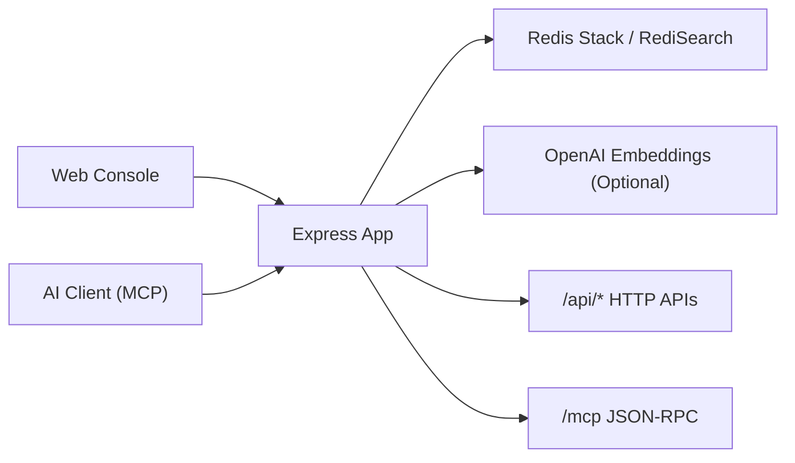

# Redis-RAG

[](https://nodejs.org/)
[](https://redis.io/docs/latest/operate/oss_and_stack/stack-with-enterprise/)
[](https://modelcontextprotocol.io/)
[](https://www.docker.com/)

一个基于 **JavaScript + Redis Stack** 的轻量 RAG 服务，支持：

- HTTP 文档检索与管理 API
- 标准 MCP (`/mcp`) 远程工具调用
- 控制台页面（登录、监控、文档管理、API Key 管理）

如果你要把检索能力分发给 AI 客户端（Claude/Cursor 等），调用方通常只需要两项：

- `MCP_URL`
- `MCP_TOKEN`

---

## 目录

- [为什么用 Redis-RAG](#为什么用-redis-rag)
- [5 分钟快速开始](#5-分钟快速开始)
- [给 AI 客户端的最短接入](#给-ai-客户端的最短接入)
- [核心 API 一览](#核心-api-一览)
- [MCP 协议支持](#mcp-协议支持)
- [配置项](#配置项)
- [系统架构](#系统架构)
- [项目结构](#项目结构)
- [FAQ](#faq)
- [Roadmap](#roadmap)

---

## 为什么用 Redis-RAG

- 开箱即用：`docker compose up` 后可直接体验完整链路
- 双入口设计：既支持传统 HTTP API，也支持标准 MCP
- 文档过滤能力：语义检索可结合 `keyword/source/tags` 做混合筛选
- 认证闭环：登录、首次改密、长期 API Key、Key 吊销都内置
- 可观测性：提供 `/api/health` 与 `/api/metrics`

---

## 5 分钟快速开始

### 1) 启动服务

```bash
git clone https://github.com/steven-ld/RedisRAG.git
cd RedisRAG
docker compose up --build -d
```

启动后可访问：

- 控制台登录页: `http://localhost:3000/login.html`
- 控制台首页: `http://localhost:3000`
- Redis Insight: `http://localhost:8001`

### 2) 默认账号登录（首次会强制改密）

- 用户名：`amdin`
- 密码：`RedisRAG@2026`

> 注意：代码中默认账号名是 `amdin`（不是 `admin`）。

### 3) 通过 API 获取会话 token

```bash
curl -sS -X POST http://localhost:3000/api/auth/login \
  -H "Content-Type: application/json" \
  -d '{"username":"amdin","password":"RedisRAG@2026"}'
```

首次登录后，用返回 token 调用改密接口，获取 `full` 权限 token：

```bash
curl -sS -X POST http://localhost:3000/api/auth/change-password \
  -H "Authorization: Bearer <LOGIN_TOKEN>" \
  -H "Content-Type: application/json" \
  -d '{"newPassword":"your-new-password"}'
```

### 4) 写入一条文档

```bash
curl -sS -X POST http://localhost:3000/api/documents \
  -H "Authorization: Bearer <FULL_TOKEN>" \
  -H "Content-Type: application/json" \
  -d '{
    "content":"Redis Stack supports vector similarity search with HNSW indexes.",
    "source":"redis-docs",
    "tags":["redis","vector","rag"]
  }'
```

### 5) 语义检索

```bash
curl -sS -X POST http://localhost:3000/api/search \
  -H "Authorization: Bearer <FULL_TOKEN>" \
  -H "Content-Type: application/json" \
  -d '{
    "query":"Redis 如何支持向量检索？",
    "topK":10,
    "page":1,
    "limit":5,
    "source":"redis-docs",
    "tags":["rag"]
  }'
```

---

## 给 AI 客户端的最短接入

### 1) 服务方创建 MCP Token

`POST /api/auth/api-keys` 返回的 `key` 字段就是 `MCP_TOKEN`。

```bash
curl -sS -X POST http://localhost:3000/api/auth/api-keys \
  -H "Authorization: Bearer <FULL_TOKEN>" \
  -H "Content-Type: application/json" \
  -d '{"name":"partner-a","expiresInDays":365}'
```

### 2) 分发给调用方两项配置

```bash
MCP_URL=https://your-domain.com/mcp
MCP_TOKEN=<API_KEY>
```

### 3) 客户端配置示例（Claude / Cursor 通用思路）

```json
{
  "mcpServers": {
    "redis-rag": {
      "url": "https://your-domain.com/mcp",
      "headers": {
        "Authorization": "Bearer YOUR_MCP_TOKEN"
      }
    }
  }
}
```

### 4) 连通性验证

```bash
curl -sS -X POST "$MCP_URL" \
  -H "Content-Type: application/json" \
  -H "Authorization: Bearer $MCP_TOKEN" \
  -d '{
    "jsonrpc":"2.0",
    "id":1,
    "method":"initialize",
    "params":{"protocolVersion":"2025-11-25","capabilities":{}}
  }'
```

---

## 核心 API 一览

### 认证

- `POST /api/auth/login`
- `POST /api/auth/change-password`
- `GET /api/auth/session`

### 文档

- `POST /api/documents` 新增文档
- `GET /api/documents` 分页 + 条件筛选
- `DELETE /api/documents/:id` 删除文档

`GET /api/documents` 支持参数：

- `page` 默认 `1`
- `limit` 默认 `6`，最大 `50`
- `keyword` 内容模糊匹配
- `source` 来源精确匹配
- `tags` 逗号分隔，默认命中任一标签即可
- `tagMode=all` 时，检索会要求文档同时命中所有标签

### 检索

- `POST /api/search`

支持参数：`query`, `topK`, `page`, `limit`, `keyword`, `source`, `tags`, `tagMode`。

### 监控

- `GET /api/health`
- `GET /api/metrics`

### API Key

- `POST /api/auth/api-keys` 创建
- `GET /api/auth/api-keys` 列表
- `DELETE /api/auth/api-keys` 吊销

权限规则：

- API Key 可访问 `POST /mcp`
- API Key 可访问 `GET /api/metrics`
- API Key **不能**访问其他 `/api/*` 业务接口

---

## MCP 协议支持

### HTTP MCP 入口

- `POST /mcp`

### 已实现方法

- `initialize`
- `ping`
- `tools/list`
- `tools/call`

### 可用工具

- `search_documents`
- `list_documents`

### 协议版本

服务端支持并协商以下版本：

- `2025-11-25`（默认）
- `2025-06-18`
- `2025-03-26`
- `2024-11-05`

### `tools/call` 示例

```bash
curl -sS -X POST "$MCP_URL" \
  -H "Content-Type: application/json" \
  -H "Authorization: Bearer $MCP_TOKEN" \
  -d '{
    "jsonrpc":"2.0",
    "id":2,
    "method":"tools/call",
    "params":{
      "name":"search_documents",
      "arguments":{
        "query":"Redis vector search",
        "topK":5,
        "limit":5
      }
    }
  }'
```

---

## 配置项

| 变量 | 默认值 | 说明 |
|---|---|---|
| `PORT` | `3000` | 服务端口 |
| `REDIS_URL` | `redis://localhost:6379` | Redis 地址 |
| `VECTOR_INDEX_NAME` | `rag_idx` | RediSearch 索引名 |
| `VECTOR_KEY_PREFIX` | `doc:` | 文档键前缀 |
| `EMBEDDING_PROVIDER` | `simple` | `simple` 或 `openai` |
| `EMBEDDING_DIM` | `256` / `1536` | 向量维度（`openai` 通常为 `1536`） |
| `OPENAI_API_KEY` | 空 | `EMBEDDING_PROVIDER=openai` 时必填 |
| `OPENAI_EMBEDDING_MODEL` | `text-embedding-3-small` | OpenAI embedding 模型 |

### 切换到 OpenAI Embedding

```bash
EMBEDDING_PROVIDER=openai
EMBEDDING_DIM=1536
OPENAI_API_KEY=your_key
OPENAI_EMBEDDING_MODEL=text-embedding-3-small
```

---

## 系统架构



---

## 项目结构

```text
.
├── src/
│   ├── app.js          # HTTP 服务 + /mcp 入口
│   ├── redis.js        # Redis 数据层、认证、检索、指标
│   ├── mcp-tools.js    # MCP 工具定义与执行
│   ├── mcp-server.js   # MCP stdio server（可选）
│   ├── embeddings.js   # simple/openai 向量生成
│   └── config.js       # 配置解析
├── public/             # 控制台前端
├── docker-compose.yml
├── Dockerfile
└── README.md
```

---

## 本地开发

```bash
npm install
npm run dev
```

其他脚本：

- `npm start`：生产方式启动
- `npm run mcp:start`：启动 MCP stdio server
- `npm run check`：基础语法检查

---

## FAQ

### 为什么我能登录但很多接口返回 `PASSWORD_CHANGE_REQUIRED`？

这是首次登录保护机制。你需要先调用 `POST /api/auth/change-password`，拿到新的 full token。

### `/mcp` 和 `/api/metrics` 有什么区别？

- `/mcp`：给 AI 客户端调用检索工具
- `/api/metrics`：给监控看运行状态

它们都支持 API Key，但用途不同。

### 为什么 `usageRate` 可能是 `0`？

当 Redis 未设置 `maxmemory`（值为 `0`）时，内存占用率无法按上限计算，会显示为 `0`。

---

## 性能测试报告

详细检索性能测试结果见 [BENCHMARK.md](./BENCHMARK.md)。

测试覆盖：

- 基础语义检索（T1-T12，12 种不同主题查询）
- source 精确过滤（T13）
- 多标签 AND 组合过滤（T14）
- keyword 关键词过滤（T15）
- topK=20 批量检索（T16）
- 分页查询（T17）
- 超长查询（T18）
- 无关查询降级（T19）
- 无匹配时 keyword 回退（T20）

87 篇文档环境下，平均检索延迟约 20ms。

---

## Roadmap

- [ ] 增加批量导入接口（减少逐条写入成本）
- [ ] 增加文档更新接口（目前删除+新增）
- [ ] 增加更细粒度的 API Key 权限模型
- [x] 增加检索评测样例与基准数据集

---

如果这个项目对你有帮助，欢迎 Star 和提 Issue，一起把它打磨成更实用的 Redis RAG 基础设施。
